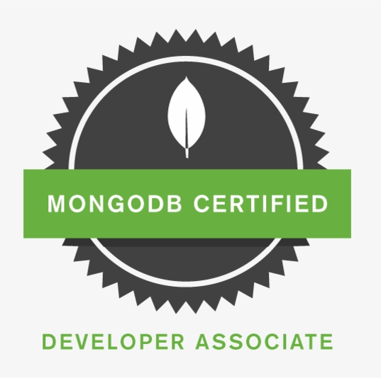
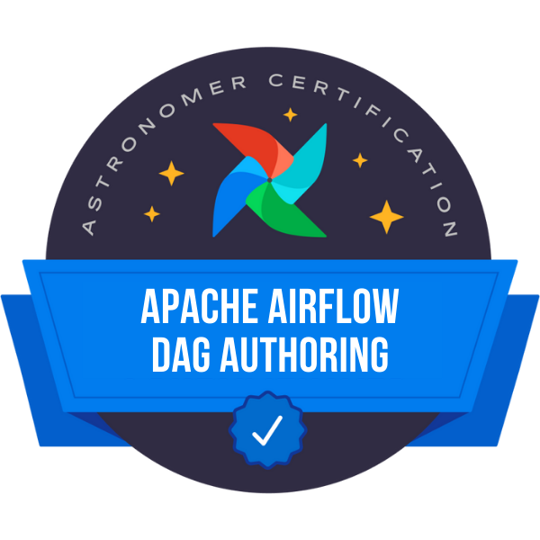
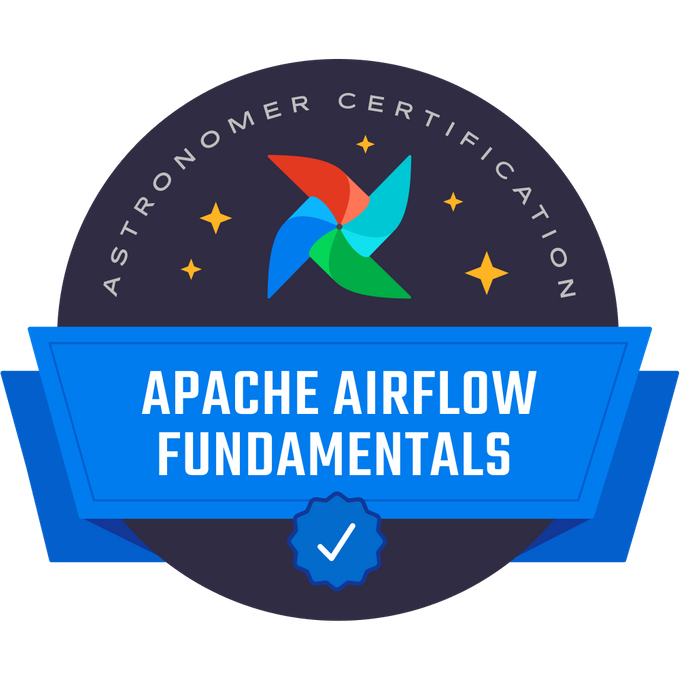
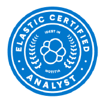

# J.M Blog

Challenge the new!

## Introduction

데이터 엔지니어 최정민입니다.

Cloud Service를 활용한 System구성, 기능 개발 운영 활동에 흥미를 느끼고 있으며 다양한 Open Source들과 접목을 시도합니다.

경험과 기록의 가치를 알기에 다양한 경험과 기록을 Blog 에 정리합니다.

Architecture 구성 및 AWS Service 활용 Data 처리 기능 개발을 생활화 합니다.

함께 그리고 먼저 배우고, 공유하며 성장하고 싶습니다.

## 자격증

| Certification                                                | Badge                                                        |
| ------------------------------------------------------------ | ------------------------------------------------------------ |
| **MongoDB Certified Developer, Associate (C100DEV)** <blockquote><ul><li>2022.04 취득</li><li>MongoDB에 대한 전반적인 개념 이해</li><li>Python과 MongoDB 개발 Point 이해</li><li>MongoDB 운영에 대한 이해</li></ul></blockquote> |  |
| **Astronomer Certification DAG Authoring for Apache Airflow** <blockquote><ul><li>2021.11 취득</li><li>Airflow에 대한 전문적인 이해</li><li>Airflow 관리 Point 및 Issue 이해</li><li>Airflow Dag Deep Dive 개발</li></ul></blockquote> |  |
| **Astronomer Certification for Apache Airflow Fundamentals** <blockquote><ul><li>2021.10 취득</li><li>Airflow에 대한 기본적인 이해</li><li>Airflow Component의 이해 및 구축</li><li>Airflow Dag 개발</li></ul></blockquote> |  |
| **Elastic Certified Analyst** <blockquote><ul><li>2021.07 취득</li><li>Kibana에 대한 기본적인 시각화 작업 숙달</li><li>머신러닝, Map 등의 부가적인 기능과 시각화를 통한 분석 능력 향상</li><li>Kibana 공간 및 RBAC에 대한 이해</li></ul></blockquote> |  |
| **데이터분석준전문가(ADsP)** <blockquote><ul><li>2020.09 취득</li><li>데이터 저장 및 처리에 대한 전반적인 이해</li></ul></blockquote> |                                                              |
| **HashiCorp Certified Terraform Associate** <blockquote><ul><li>2020.09 취득</li><li>IaC 개념 이해</li><li>Terraform 기본 구성 이해</li><li>Terraform 모듈, CLI, 상태, 워크 플로 이해</li></ul></blockquote> |  |
| **Azure  Data Engineer Associate** <blockquote><ul><li>2020.07 취득</li><li>AZURE 기술을 기반으로 데이터 처리 및 설계 역량 증명</li><ul><li>데이터 스토리지 디자인 : Blob Storage</li><li>데이터 처리 디자인 및 개발 : Data Factory, Synapse Analytics</li><li>그 외 Event Hub 등 다양한 서비스 이해</li></ul></ul></blockquote> |  |
| **AWS certified  Big Data - Specialty** <blockquote><ul><li>2020.05 취득</li><li>AWS 기술을 기반으로 데이터 처리 및 설계 역량 증명</li><ul><li>  데이터 Lake 디자인 : S3 </li><li>데이터 처리 디자인 및 개발 : Glue, EMR</li><li>그 외 Kinesis Service 등 다양한 서비스 이해</li></ul></ul></blockquote> |  |
| **AWS certified  Solutions Architect  Associate** <blockquote><ul><li>2020.03 취득</li><li>AWS 기술을 기반으로 네트 워크에 대한 기본 이해, 가용성, 확장성을 갖춘 시스템 설계 역량 증명</li><ul><li>VPC, Subnet, NACL, SG, ENI</li><li>Multi AZ 구성</li><li>Auto Scaling Group</li><li>그 외 Load balancer 등의 다양한 서비스 이해 </li></ul></ul></blockquote> |  |
| **정보처리기사** <blockquote><ul><li>2019.11 취득</li><li>CS에 대한 전반적인 이해</li></ul></blockquote> |                                                              |
