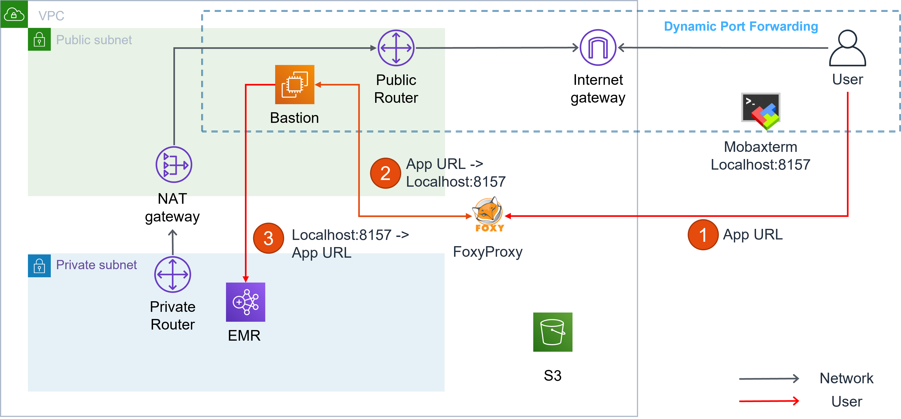
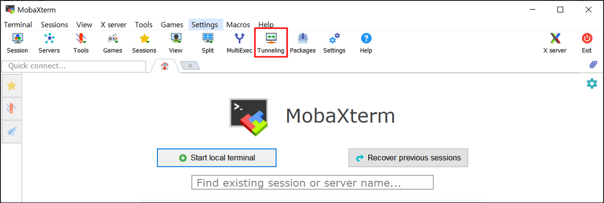
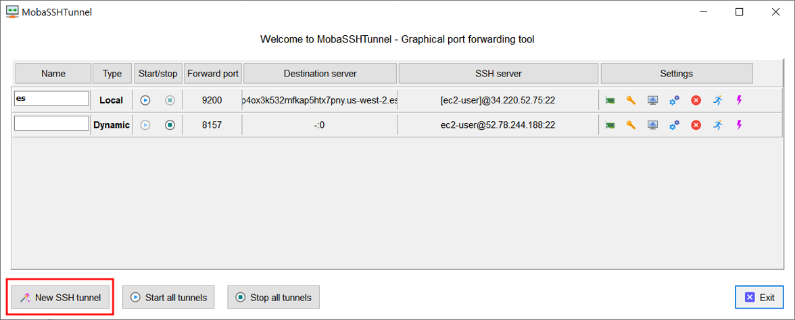
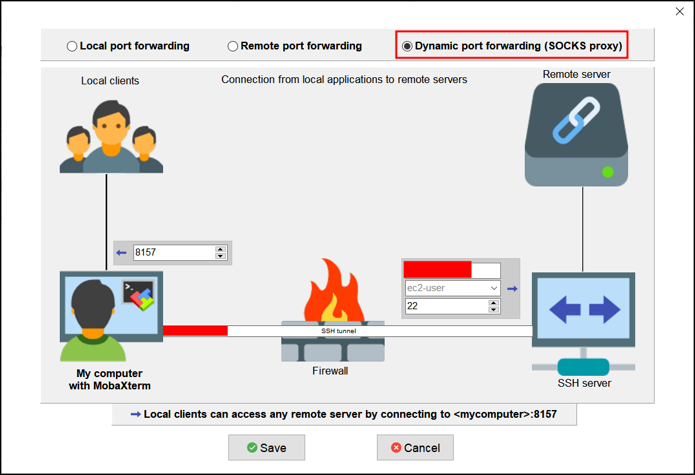
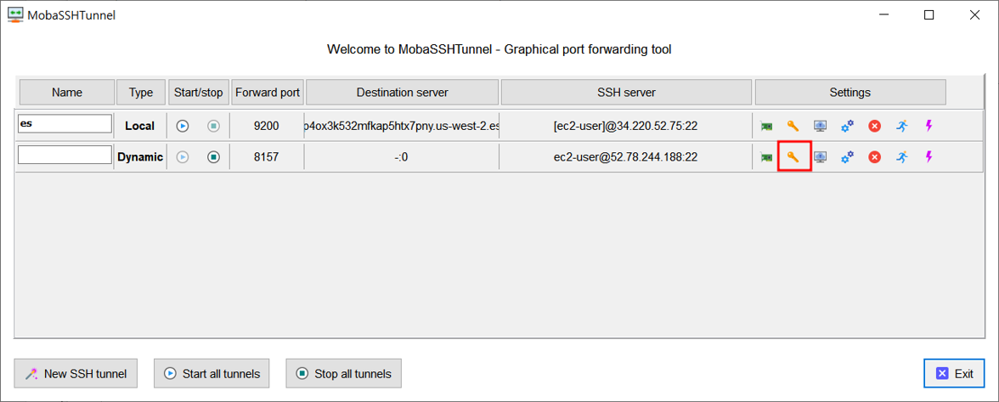
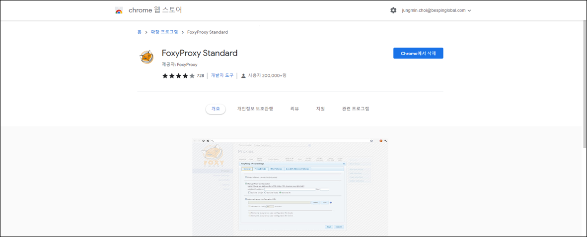
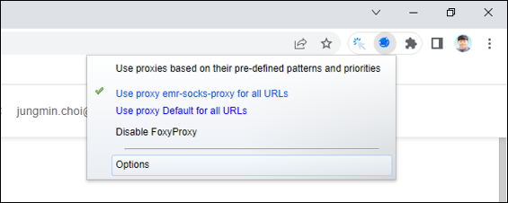
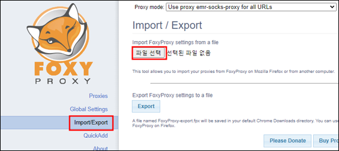
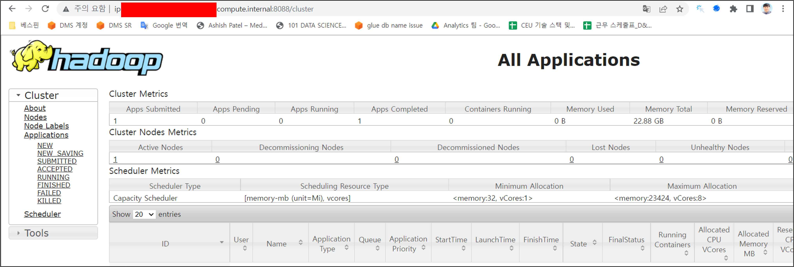

1. [AWS](#aws)
   - [Architecture](#architecture)
   - [Security Group](#security-group)
2. [MobaXterm](#mobaxterm)
3. [FoxyProxy](#foxyproxy)
4. [Result](#result)

## AWS

### Architecture



> Bastion은 MobaXterm의 Dynamic Port Forwarding을 활용하여 Localhost:8157로 접근 가능하며 해당 URI 로 접근 시 전달되는 Target URL로 Forwarding 함
>
> 단, Bastion은 Target URI(EMR Application) 에 접근 가능
>
> 1. User가 EMR Application의 Private DNS를 Browser에 검색
> 2. FoxyProxy 가 적용된 XML 파일에 따라 하위 내용 수행
>    1. 적용 대상 URL 인지 판별
>    2. 적용 대상 URL 의 경우 Localhost:8157로(Bastion) Target 전달
> 3. Bastion을 통해 EMR Application에 접근

### Security Group

Bastion Security Group

| Type       | Protocol | Port  Range | Source          | Description             |
| ---------- | -------- | ----------- | --------------- | ----------------------- |
| Custom TCP | TCP      | **8157**    | {Current My IP} | From Bespin Forwarding  |
| SSH        | TCP      | 22          | {Current My IP} | From Bespin  SSH Access |

EMR Master Security Group

| Type            | Protocol | Port  range | Source                     | Description          |
| --------------- | -------- | ----------- | -------------------------- | -------------------- |
| All TCP         | TCP      | 0 – 65535   | **{Bastion SG ID}**        | From Bastion         |
| Custom TCP      | TCP      | 8443        | {EMR ServiceAccess  SG ID} | EMR-ServiceAccess-SG |
| All TCP         | TCP      | 0 – 65535   | {EMR Slave SG ID}          | EMR-Slave-SG         |
| All UDP         | UDP      | 0 – 65535   | {EMR Slave SG ID}          | EMR-Slave-SG         |
| All UDP         | UDP      | 0 – 65535   | {EMR Master SG ID}         | Self                 |
| All TCP         | TCP      | 0 – 65535   | {EMR Master SG ID}         | Self                 |
| All ICMP - IPv4 | ICMP     | All         | {EMR Master SG ID}         | Self                 |
| All ICMP - IPv4 | ICMP     | All         | {EMR Slave SG ID}          | EMR-Slave-SG         |

## MobaXterm

1. MobaXterm의 Tunneling Tab 선택. Putty나 WSL로 대체 가능
   

2. 신규 Tunneling 생성
   

3. Tunneling 값 설정
   

   > - Dynamic port forwarding 선택
   > - My Computer Port는 8157
   >   - 8157은 Local PC에서 미사용 중인 Port
   >   - 다른 Port를 사용하려면 후에 나오는 모든 설정 값을 해당 port로 명시
   > - SSH server는 Bastion 값으로 표기
   >   - Bastion IP
   >   - Bastion Username
   >   - Bastion port (default 22)

4. 인증 설정 (Pem, PPK)
   

## FoxyProxy

1. Chrome Extension 설치
   

2. Proxy xml 정의(EMR 기준)
   ```xml
   <?xml version="1.0" encoding="UTF-8"?>
   <foxyproxy>
       <proxies>
           <proxy name="emr-socks-proxy" id="2322596116" notes="" fromSubscription="false" enabled="true" mode="manual" selectedTabIndex="2" lastresort="false" animatedIcons="true" includeInCycle="true" color="#0055E5" proxyDNS="true" noInternalIPs="false" autoconfMode="pac" clearCacheBeforeUse="false" disableCache="false" clearCookiesBeforeUse="false" rejectCookies="false">
               <matches>
                   <match enabled="true" name="*ec2*.amazonaws.com*" pattern="*ec2*.amazonaws.com*" isRegEx="false" isBlackList="false" isMultiLine="false" caseSensitive="false" fromSubscription="false" />
                   <match enabled="true" name="*ec2*.compute*" pattern="*ec2*.compute*" isRegEx="false" isBlackList="false" isMultiLine="false" caseSensitive="false" fromSubscription="false" />
                   <match enabled="true" name="10.*" pattern="http://10.*" isRegEx="false" isBlackList="false" isMultiLine="false" caseSensitive="false" fromSubscription="false" />
                   <match enabled="true" name="*10*.amazonaws.com*" pattern="*10*.amazonaws.com*" isRegEx="false" isBlackList="false" isMultiLine="false" caseSensitive="false" fromSubscription="false" />
                   <match enabled="true" name="*10*.compute*" pattern="*10*.compute*" isRegEx="false" isBlackList="false" isMultiLine="false" caseSensitive="false" fromSubscription="false" />
                   <match enabled="true" name="*.compute.internal*" pattern="*.compute.internal*" isRegEx="false" isBlackList="false" isMultiLine="false" caseSensitive="false" fromSubscription="false" />
                   <match enabled="true" name="*.ec2.internal*" pattern="*.ec2.internal*" isRegEx="false" isBlackList="false" isMultiLine="false" caseSensitive="false" fromSubscription="false" />
               </matches>
               <manualconf host="localhost" port="8157" socksversion="5" isSocks="true" username="" password="" domain="" />
           </proxy>
       </proxies>
   </foxyproxy>
   ```

3. XML import

   - 
   - 
   - 

## Result


