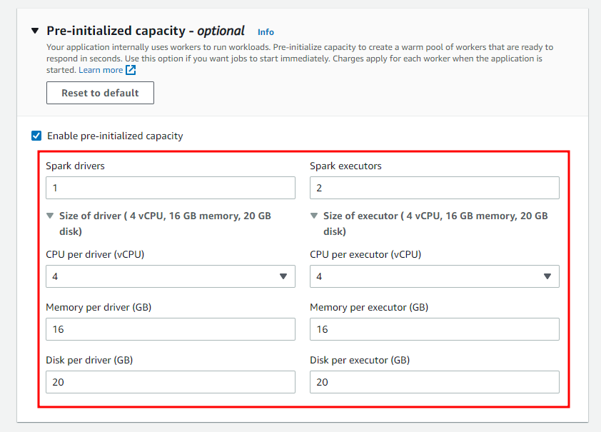
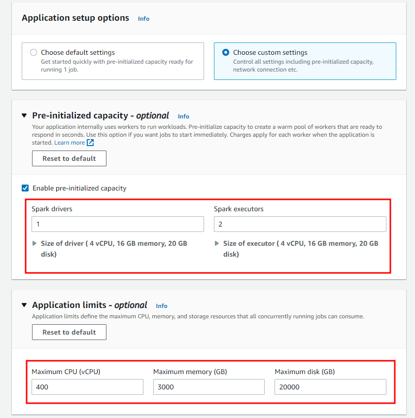

EMR Serverless는 Apache Spark 및 Apache Hive와 같은 최신 오픈 소스 프레임워크를 사용하는 분석 애플리케이션의 운영을 단순화하는 서버리스 런타임 환경을 제공하는 서비스 입니다.

Serverless인 만큼 애플리케이션을 실행하기 위해 클러스터를 구성, 최적화, 보안 또는 운영할 필요가 없고 애플리케이션에 필요한 리소스를 자동으로 결정하고 이러한 리소스를 가져와 작업을 처리하고 작업이 완료되면 리소스를 해제합니다.

## 1. Component

### 1. Application

Spark 또는 Hive Application에 대한 Configuration을 정의 하는 서비스

하단의 경우에 Application을 분리하는 것이 좋습니다.

- Spark과 Hive를 모두 사용해야하는 경우
- 같은 오픈 소스여도 Version이 다른 경우
- 한 버전에서 다른 버전으로 업그레이드할 때 A/B 테스트 수행하는 경우
- 운영과 개발환경에 대한 분리가 필요한 경우
- 부서 간의 비용을 확인 등의 이유로 논리적인 분리가 필요한 경우
- 서로 다른 LOB(기간 업무) 애플리케이션 분리하는 경우

### 2. Job Run

HiveQL 쿼리 또는 Pyspark Script 등 정의된 작업들을 비동기로 제출 및 실행하고 완료 시점까지 추척하는 서비스 입니다.

각 작업은 별도의 IAM으로 권한이 분리되고 작업이 제출되는 동시에 작업을 수행합니다.

Concurrency에 대한 제한 사항을 명시되지 않았고(기존 EMR 최대 25개) 제출된 작업에 따라 Worker가 Auto Scaling 됩니다.

Concurrency가 명시되어 있지 않으므로 기존 EMR EC2에서 하던 작업처럼 Concurrency를 1로 제한하여 Job들간의 Dependency를 만들 수 없습니다.

작업을 수행하기 위해서는 Worker가 Provisioning 되어야하고 되어있지 않은 경우 작업에 따라 5 ~ 10 분 정도 Starting Time이 발생합니다. 

위와 같은 Starting Time에 대한 시간을 감축하기 위해서는 Application Level에서 Worker에 대한 Pre-Initializing을 수행합니다.

### 3. Worker

EMR Serverless Application에서 내부적으로 사용하는 개념. Console과 AWS CLI를 비교해볼 때 Worker란 Spark의 Driver와 Executor, Hive의 Tez_Task 등 모두를 일컫는 말이라고 유추할 수 있다.

| Console                                                | AWS CLI                                                      |
| ------------------------------------------------------ | ------------------------------------------------------------ |
|  | aws emr-serverless create-application<br /> --type "SPARK"<br />--name my_application_name<br />--release-label emr-6.7.0<br />--initial-capacity '{<br/>    "DRIVER": {<br/>        "**workerCount**": 5,<br/>        "**workerConfiguration**": {<br/>            "cpu": "2vCPU",<br/>            "memory": "4GB"<br/>        }<br/>    },<br/>    "EXECUTOR": {<br/>        "**workerCount**": 50,<br/>        "**workerConfiguration**": {<br/>            "cpu": "4vCPU",<br/>            "memory": "8GB"<br/>        }<br/>    }<br/>  }' \<br/>  --maximum-capacity '{<br/>    "cpu": "400vCPU",<br/>    "memory": "1024GB"<br/>  }' |

위의 내용처럼 빠른 워크로드 처리를 위해서는 사전 초기화 작업을 통해 Worker를 미리 구성하여 작업이 가능합니다. 

Workload의 부하에 따라 Worker는 확장 또는 축소 되기 때문에 용량에 대한 계산 등 별도의 최적화 작업이 요구되지는 않습니다.

## 2. IAM

### 1. 사용자 권한

EMR Serverless를 사용하기 위해서는 IAM User, Role(Role switching의 경우) 하기와 같은 권한이 있어야 합니다.

1. **EMRStudioCreate** : EMR Serverless는 EMR Studio 내부에 생성되는 Application 이므로 사전에 Studio가 생성이 되어야 하며 Studio가 하나도 없을 경우 자동으로 생성되므로 권한이 필요합니다.
2. **EMRServerlessFullAccess** : EMR Serverless 관련 Application 및 Job 생성을 위한 권한
3. **AllowEC2ENICreationWithEMRTags** : EMR Serverless Application 생성 시 필요한 ENI card 생성 권한
4. **AllowEMRServerlessServiceLinkedRoleCreation** : EMR Serverless Job 생성 시 필요한 Role 생성 권한

```json
{
    "Version": "2012-10-17",
    "Statement": [
        {
            "Sid": "EMRStudioCreate",
            "Effect": "Allow",
            "Action": [
                "elasticmapreduce:CreateStudioPresignedUrl",
                "elasticmapreduce:DescribeStudio",
                "elasticmapreduce:CreateStudio",
                "elasticmapreduce:ListStudios"
            ],
            "Resource": "*"
        },
        {
            "Sid": "EMRServerlessFullAccess",
            "Effect": "Allow",
            "Action": [
                "emr-serverless:*"
            ],
            "Resource": "*"
        },
        {
            "Sid": "AllowEC2ENICreationWithEMRTags",
            "Effect": "Allow",
            "Action": [
                "ec2:CreateNetworkInterface"
            ],
            "Resource": [
                "arn:aws:ec2:*:*:network-interface/*"
            ],
            "Condition": {
                "StringEquals": {
                    "aws:CalledViaLast": "ops.emr-serverless.amazonaws.com"
                }
            }
        },
        {    
            "Sid": "AllowEMRServerlessServiceLinkedRoleCreation",
            "Effect": "Allow",
            "Action": "iam:CreateServiceLinkedRole",
            "Resource": "arn:aws:iam::*:role/aws-service-role/*"
        }
    ]
}
```


### 2. 런타임 권한

EMR Serverless는 Application에 Job을 수행할 수 있으며 각 Job은 개별 Role이 필요합니다.

1. 신뢰 관계 : 

   ```json
   {
     "Version": "2012-10-17",
     "Statement": [
       {
         "Effect": "Allow",
         "Principal": {
           "Service": "emr-serverless.amazonaws.com"
         },
         "Action": "sts:AssumeRole"
       }
     ]
   } 
   ```

2. Policy : 

   1. ReadAccessForEMRSamples : AWS에서 제공하는 EMR Sample Script가 있는 Managed Bucket에 대한 권한

   2. FullAccessToOutputBucket : Job에 대한 산출물을 작성할 수 있는 Bucket에 대한 권한

      > {DOC-EXAMPLE-BUCKET} : 실제 Policy 생성 시 EMR 서버리스 애플리케이션을 사용하여 실행할 샘플 Spark 또는 Hive 워크로드의 로그와 출력 파일을 저장할 Bucket으로 수정

   3. GlueCreateAndReadDataCatalog : Spark이나 Hive Job에서 Glue Catalog를 조회할 수 있는 권한

   ```json
   {
       "Version": "2012-10-17",
       "Statement": [
           {
               "Sid": "ReadAccessForEMRSamples",
               "Effect": "Allow",
               "Action": [
                   "s3:GetObject",
                   "s3:ListBucket"
               ],
               "Resource": [
                   "arn:aws:s3:::*.elasticmapreduce",
                   "arn:aws:s3:::*.elasticmapreduce/*"
               ]
           },
           {
               "Sid": "FullAccessToOutputBucket",
               "Effect": "Allow",
               "Action": [
                   "s3:PutObject",
                   "s3:GetObject",
                   "s3:ListBucket",
                   "s3:DeleteObject"
               ],
               "Resource": [
                   "arn:aws:s3:::{DOC-EXAMPLE-BUCKET}",
                   "arn:aws:s3:::{DOC-EXAMPLE-BUCKET}/*"
               ]
           },
           {
               "Sid": "GlueCreateAndReadDataCatalog",
               "Effect": "Allow",
               "Action": [
                   "glue:GetDatabase",
                   "glue:CreateDatabase",
                   "glue:GetDataBases",
                   "glue:CreateTable",
                   "glue:GetTable",
                   "glue:UpdateTable",
                   "glue:DeleteTable",
                   "glue:GetTables",
                   "glue:GetPartition",
                   "glue:GetPartitions",
                   "glue:CreatePartition",
                   "glue:BatchCreatePartition",
                   "glue:GetUserDefinedFunctions"
               ],
               "Resource": ["*"]
           }
       ]
   }
   ```

   

## 3. Application

EMR Studio Domain에서 Serverless Application 생성 가능


- `Name` : Application Name
- `Type` : Spark or Hive
- `Release version` : 희망하는 EMR Version


Application setup option이 Default 인 경우 하기와 같이 기본 옵션으로 Application이 구성됨

1. `Pre-Initialized` : enable, disable 사전에 Worker를 provisioning 하는 기능 (dynamodb Pre warm과 유사)
2. `Application limits` : Auto Scaling으로 증가하는 Resource에 대한 Max Limit 정의
3. `Application behavior` : Application에 대한 자동화 기능 (자동 시작 및 자동 중지에 대한 정의)
4. `Network connections` : Network 정의


Application setup option이 Custom인 경우 위에서 기본으로 정의 했던 옵션들을 전부 개별 지정 가능




## 4. Job Run

1. `Name` : Job Name
2. `Runtime role` : Job을 수행할 IAM role
3. `S3 URI` : Spark or Hive Script
4. `Script arguments` : Script에 대한 인수


1. `Spark properties` : 해당 Job이 Spark Application에 생성되므로 Spark에 대한 Config 지정 가능

2. `Job configuration` : 앞서 설정했던 Application에 대한 Configuration을 Override 하는 영역

   > - `applicationConfiguration` : 애플리케이션 재정의 및 Spark-submit 매개변수
   > - `monitoringConfiguration` : Spark 작업의 로그를 저장할 Amazon S3 URL


1. `Metastore configuration` : Glue Data Catalog 사용 여부 선택

2. `Application logs` : Log 저장 여부와 S3에 log를 저장할 지 선택

   > - Allow AWS to retain logs for 30 days :  Amazon EMR 관리형 스토리지에 로그 저장 여부, 최대 30일 
   > - Upload logs to your Amazon S3 bucket : 개인 S3 bucket에 Log 저장 여부

3. Tags : Job에 대한 tag들


## 5. 타 서비스와의 비교

### 1. EMR EC2 vs EMR Serverless

| Version            | 6.7  기준(최신)                                              | 6.7  기준(최신)                                              |
| ------------------ | ------------------------------------------------------------ | ------------------------------------------------------------ |
| 서비스             | EMR  EC2                                                     | EMR  Serverless                                              |
| 기능               |                                                              |                                                              |
| Application        | Hadoop,  Spark, Hive, Livy 외 18 개                          | Spark,  Hive                                                 |
| Multi  Master Node | 지원                                                         | 관리  대상 아님                                              |
| Glue  Catalog      | 지원                                                         | 지원                                                         |
| Cluster  Config    | 각  Application에 대한 Configuration 지원                    | Spark,  Hive Configuration만 지원                            |
| Network            | Uniform  Group - 1 AZ<br />Fleet Instance - Multi AZ on Lauching, 1 AZ After Launching | Multi  AZ                                                    |
| Hardware           | Master,  Core, Task에 대한 별도 구성 필요                    | 자동  관리 대상                                              |
| Auto  Scaling      | Managed,  Custom Autoscaling 지원                            | Managed  Autoscaling, PreInitializing(Pre warm) 지원         |
| Auto  Managing     | Auto  Termination 지원 (**Stop 기능 없음**)                  | Auto  Start, Stop 기능 지원                                  |
| Logging            | S3  지원                                                     | S3 지원                                                      |
| AMI                | Managed,  Custom AMI 지원                                    | Managed  AMI 지원                                            |
| Bootstrap  Action  | 지원                                                         | **지원 안함**                                                |
| Terminal  접속     | 지원                                                         | **지원 안함**                                                |
| IAM                | Default,  Custom 지원                                        | Default,  Custom 지원 (단 Job 별 IAM)                        |
| Security  Group    | Master,  Core 별도 지원                                      | 단일  Security Group                                         |
| Notebook           | 지원                                                         | **지원 안함**                                                |
| 작업 제출          | Step을  통한 지원<br />기본적으로 Shell Script 지원<br />Application 별 작업 지원(Spark, Hive, Hadoop)<br />Concurrency를 통한 step별 dependency 적용 가능 | Job을  통한 지원<br />Spark, Hive Application만 지원<br />**Concurrency 지원 안함** |
| Monitoring         | pre-signed  url (EMR에서 제공하는 바로가기)<br />Application URL (application dns) | pre-signed  url (EMR에서 제공하는 바로가기)                  |

### 2. Glue Job vs EMR Serverless

| Version        | 3.0  기준(최신)                                              | 6.7  기준(최신)                                      |
| -------------- | ------------------------------------------------------------ | ---------------------------------------------------- |
| 서비스         | Glue                                                         | EMR  Serverless                                      |
| 기능           |                                                              |                                                      |
| Application    | Spark,  Hive(Glue catalog)                                   | Spark,  Hive                                         |
| Runtime        | Python,  Pyspark, Scala                                      | Python,  Pyspark, Scala                              |
| Glue  Catalog  | 지원                                                         | 지원                                                 |
| Configuration  | Spark  Configuration 지원 (Code Level)                       | Spark,  Hive Configuration 지원                      |
| Network        | Public,  Private 지원                                        | Public,  Private 지원                                |
| Auto  Scaling  | Managed  Autoscaling 지원                                    | Managed  Autoscaling, PreInitializing(Pre warm) 지원 |
| Logging        | CloudWatch  지원 / SparkUI log - S3 지원                     | S3 지원                                              |
| IAM            | Job  별 IAM                                                  | Job  별 IAM                                          |
| Notebook       | 지원                                                         | **지원 안함**                                        |
| 작업 제출      | Glue  Job, Interactive Shell, Glue Endpoint                  | Job  Run                                             |
| Monitoring     | Glue  Studio Monitoring, ClowdWatch 지원<br />Spark UI - **별도의 Spark UI 서버 구성 필요** | 지원                                                 |
| Orchestration  | Glue  Workflow                                               | **지원 안함**                                        |
| Starting  Time | 1분  내외                                                    | **5분 내외**                                         |

---

참고 자료

[EMR Serverless 개념](https://docs.aws.amazon.com/emr/latest/EMR-Serverless-UserGuide/emr-serverless.html#concepts)

[실행 중인 작업](https://docs.aws.amazon.com/emr/latest/EMR-Serverless-UserGuide/jobs.html)

[Worker 계산](https://docs.aws.amazon.com/ko_kr/emr/latest/EMR-Serverless-UserGuide/application-capacity.html#pre-init-capacity)

[EMR Serverless Guide](https://luminousmen.com/post/emr-serverless-a-400level-guide/)
