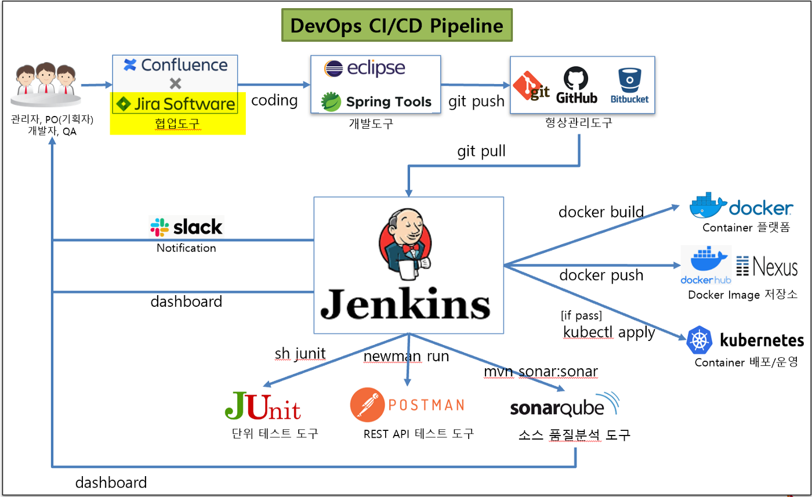
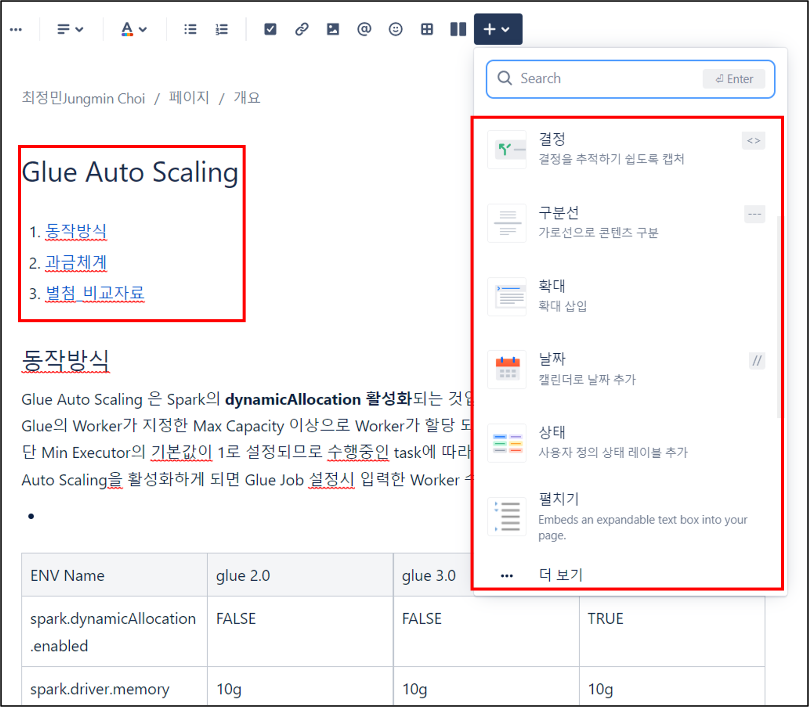
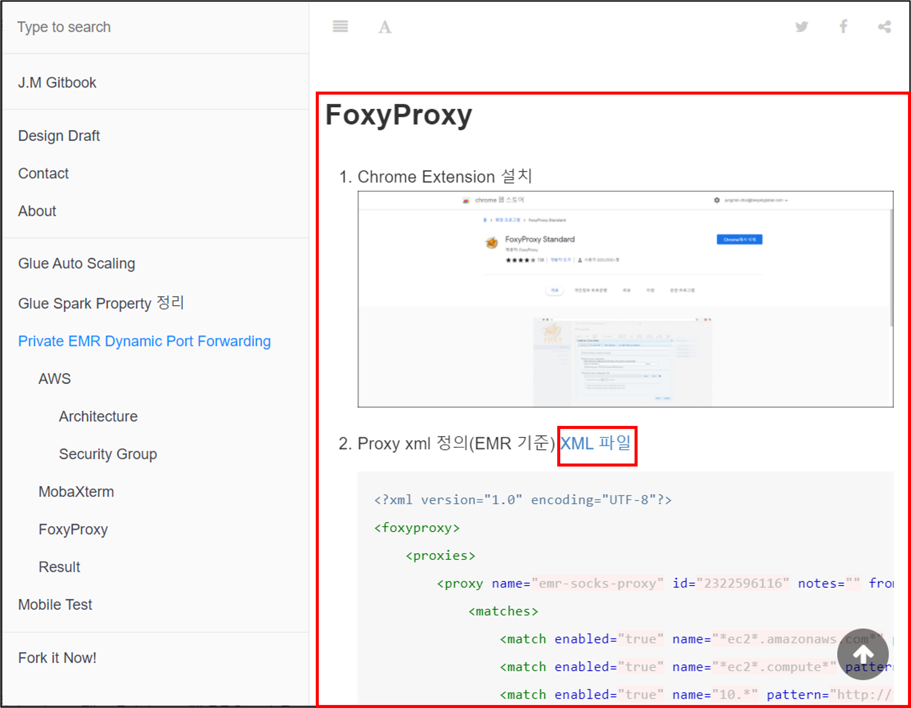
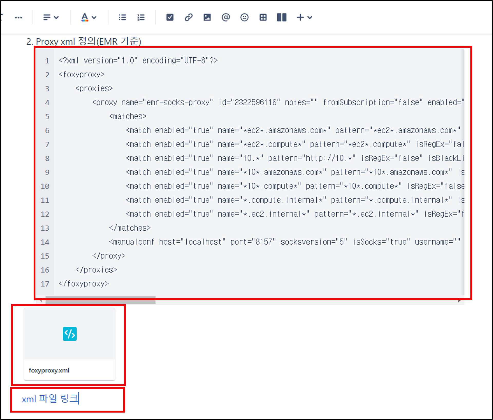
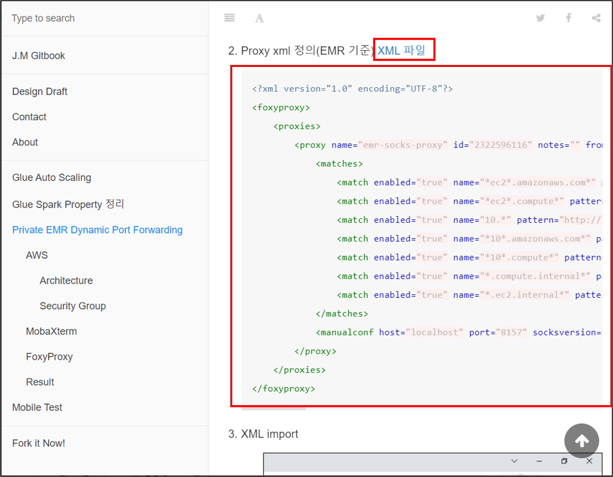
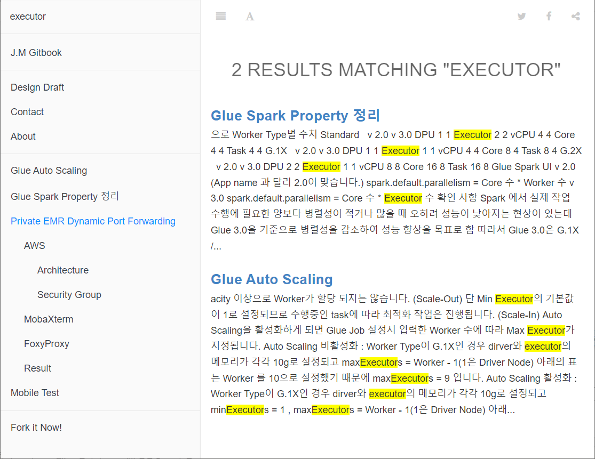
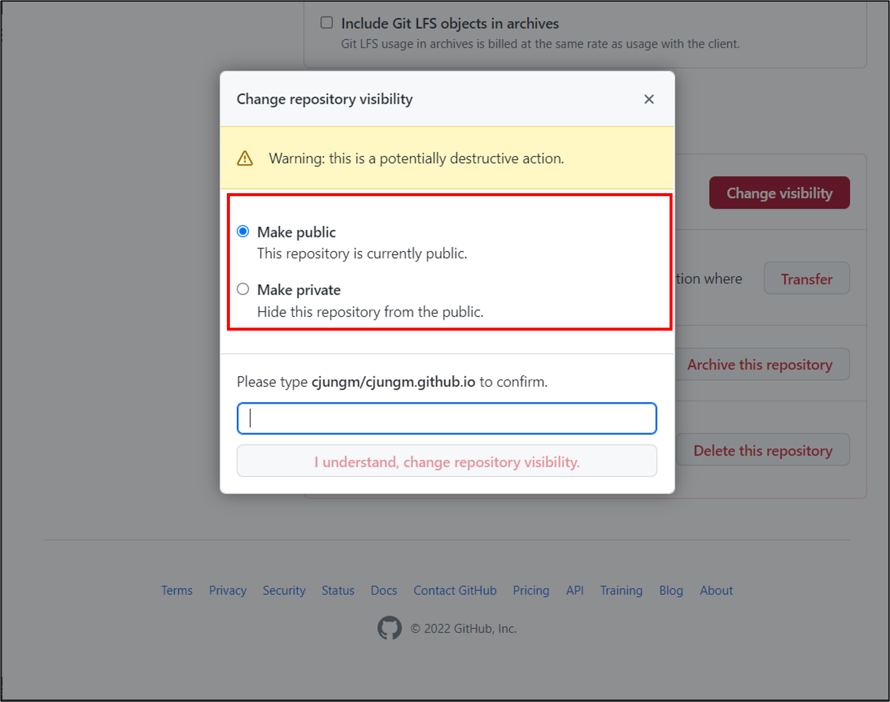
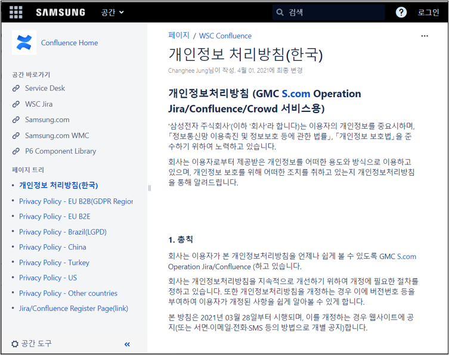
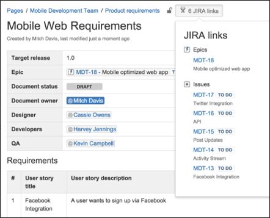
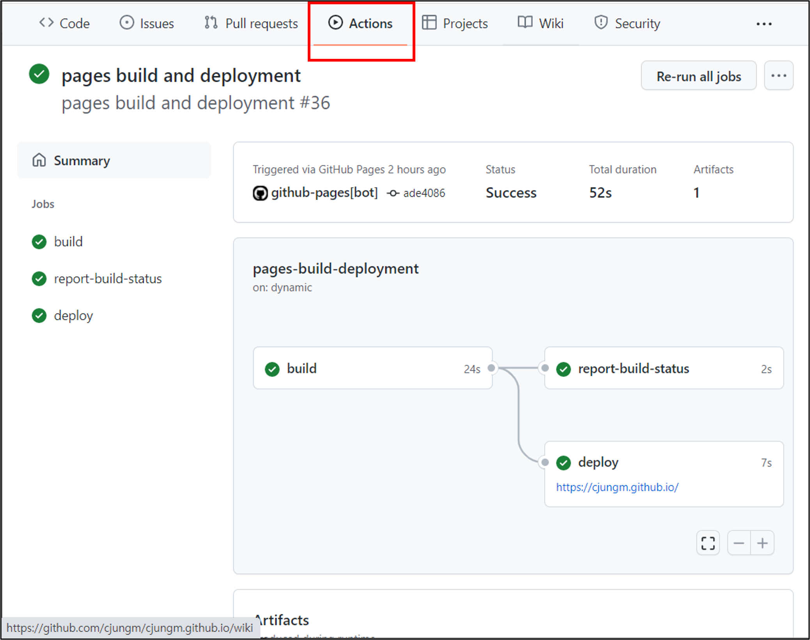

1. [Tech Blog](#tech-blog)
2. [Comparison](#comparison)
3. [Conclusion](#conclusion)

## Tech Blog

- Confluence

  >- 아틀라시안(Atlassian)에서 개발한 자바 기반의 소프트웨어
  >
  >- 팀, 업무 단위로 Space를 분할하여 작업 내용을 공유
  >
  >- 문서나 파일 등을 공유 및 작업할 수 있는 협업 Tool
  >
  >- 문서 정리 이외에도 Jira나 Slack 등의 협업 Solution과의 연동을 통해 확장 가능
  >
  >  
  >  [참조 링크](https://www.google.com/url?sa=i&url=https%3A%2F%2Fmedium.com%2Fdtevangelist%2Fdevops-jira%25EB%25A5%25BC-%25ED%2599%259C%25EC%259A%25A9%25ED%2595%259C-%25ED%2598%2591%25EC%2597%2585-1%25EB%25B6%2580-63c71489f21d&psig=AOvVaw2VoF0s70t6kErLW3sirtld&ust=1651025255723000&source=images&cd=vfe&ved=0CAwQjRxqFwoTCJC_l8LSsPcCFQAAAAAdAAAAABAD)

- GitHub

  > - 소프트웨어 개발에서 소스 코드를 효과적으로 관리할 수 있도록 하는 무료, 공개 소프트웨어
  >
  > - 프로젝트 폴더 내에서 작업을 기록하고, 버전 관리를 통해 체계적인 개발이 가능
  >
  > - 분산 관리 시스템 기반의 협업 솔루션으로서 팀, 또는 업무 단위로 Code 및 문서를 작성하고 공유 가능
  >
  > - Blog나 Wiki등 문서 정리 이외에도 Repository나 Actions 등 CI/CD 기능으로도 많이 사용
  >
  >   
  >   [참조 링크](https://www.google.com/imgres?imgurl=https%3A%2F%2Fdz2cdn1.dzone.com%2Fstorage%2Ftemp%2F13365213-workflow.png&imgrefurl=https%3A%2F%2Fdzone.com%2Farticles%2Fautomate-your-development-workflow-with-github-act-1&tbnid=_HVEhXG_02IbLM&vet=10CBkQxiAoCWoXChMIoJXB6NOw9wIVAAAAAB0AAAAAEAc..i&docid=8W0kHUU4PGqtIM&w=967&h=465&itg=1&q=github%20git%20Actions&hl=ko&safe=active&ved=0CBkQxiAoCWoXChMIoJXB6NOw9wIVAAAAAB0AAAAAEAc)

## Comparison

1. 편리성

   > 작성의 편리함
   >
   > - Confluence는 마크다운 뿐만 아니라 다양한 File 첨부 및 Embedding 기능 제공
   > - GitHub은 마크다운 제공 및 링크를 통한 참조 기능 제공

   | Confluence | GitHub |
   | :------: | :------: |
   |  |  |

2. 연동성

   > 외부와의 연동성
   >
   > - Confluence는 문서 내 작성, 개별 파일 첨부, 링크를 통한 참조(외부 소스코드 저장소 필요)
   > - GitHub은 문서 내 작성, 링크를 통한 참조(Git Repository 참조)

   |                          Confluence                          |                            GitHub                            |
   | :----------------------------------------------------------: | :----------------------------------------------------------: |
   |  |  |

3. 공유성

   > 문서 탐색
   >
   > - Confluence는 space, author, type, 검색어 단위의 검색이 가능합니다.(built-in 기능)
   > - GitHub은 텍스트 검색 엔진 사용시 검색어 단위의 검색 가능

   |                          Confluence                          |                            GitHub                            |
   | :----------------------------------------------------------: | :----------------------------------------------------------: |
   |  |  |

   > 외부 공유
   >
   > - Confluence는 space, page 단위의 Access Control이 가능하므로 외부 공유 가능합니다. (익명 사용자에 대한 권한제어 가능)
   > - GitHub은 Repository 단위의 Access Control만 가능하므로 외부 공유를 위한 별도의 Repository 구성 필요(이중 작업)

   |                          Confluence                          |                        GitHub                        |
   | :----------------------------------------------------------: | :--------------------------------------------------: |
   |  |  |

4. 확장성

   > 개인 역량
   >
   > - Confluence는 삼성 등의 표준화 된 사례들이 다양하며 Jira 등의 서비스와 확장해서 사용할 경우 더 큰 장점이 있습니다.
   >
   > - GitHub은 다양한 사례가 있고 개인 블로그나 포트폴리오 사용사례도 많습니다. 
   >
   >   Repository, Actions 등과 같이 CI/CD 기능 등을 사용할 수 있는 개발자 친화 서비스 입니다.

   |                          Confluence                          |                            GitHub                            |
   | :----------------------------------------------------------: | :----------------------------------------------------------: |
   |  [참조 링크](https://op-cfl.samsung.com/pages/viewpage.action?pageId=118620594) |  [참조 링크](https://yanolja.github.io/) |
   |  [참조 링크](https://www.google.com/url?sa=i&url=https%3A%2F%2Fconfluence.atlassian.com%2Fdisplay%2FDOC%2FUse%2BJira%2Bapplications%2Band%2BConfluence%2Btogether&psig=AOvVaw2uVwRBwTF2z9VNsOAdocNS&ust=1651026935552000&source=images&cd=vfe&ved=0CAwQjRxqFwoTCPD53eLYsPcCFQAAAAAdAAAAABAD) |  |

   ## Conclusion

> Confluence는 문서 작성에 강점이 있고 비개발자에게도 친화적인 서비스 입니다.
>
> GitHub은 Code 통합에 대한 강점이 있고 개발자에게 친화적인 서비스 입니다.

| **항목**               | **Confluence**                                               | **GitHub**                                                   |
| :----------------------: | ------------------------------------------------------------ | ------------------------------------------------------------ |
| 작성의 편리함          | **•마크다운  제공   •Plugin들을  통한 파일 Preview나 Embedding  가능** | •마크다운  제공                                              |
| 소스코드 연동성        | •코드블록을  통한 작성   •파일  첨부   •별도의  소스 코드 저장소 필요 | **•코드블록을  통한 작성 가능   •연결된  Repository의  호환 가능** |
| 탐색의 용이성  / 공유성 | **•빌트인  검색 기능   •Space/ Page 단위의  공개 여부 설정 기능이 있음** | •제공되는  엔진을 통한 검색 기능(테마)   •Repository  단위의  공개 여부 설정 기능 |
| 표준성, 확장성         | •표준이  정해진 타사 Confluence  많은 사례   •기능을 확장 시 타 서비스들과 연동성이 높음 | **•개인  기술 블로그를 작성법에 대한 역량 강화   •CI/CD를  고려 했을 경우 확장성이 높음** |
| 접근성                 | **•모바일  App을  통한 Read/Write가  자유로움**              | •모바일  App을  통한 Read는  자유로움   •모바일로  Write  시  웹 URL로  접근 •단 건 파일 씩 Upload해야 하므로 복잡함 |
