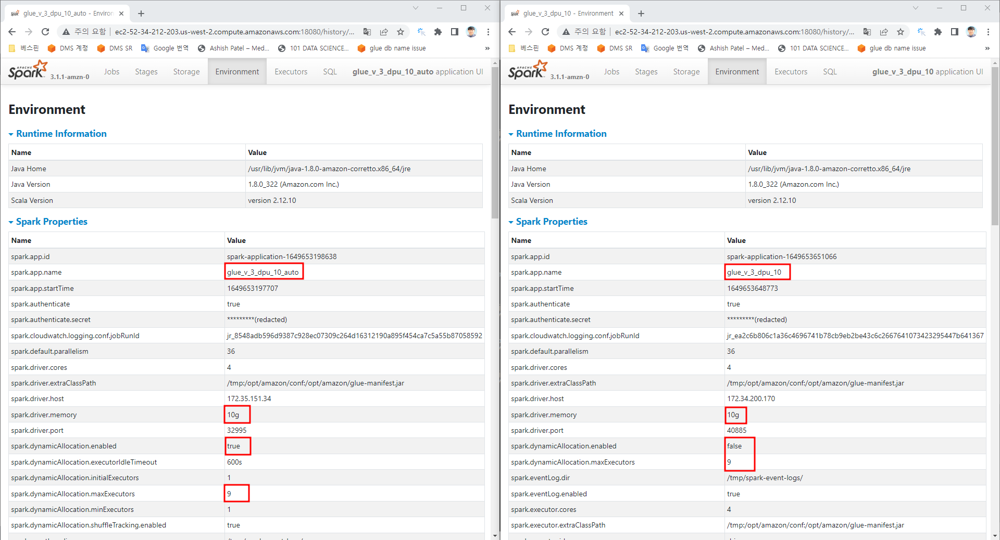
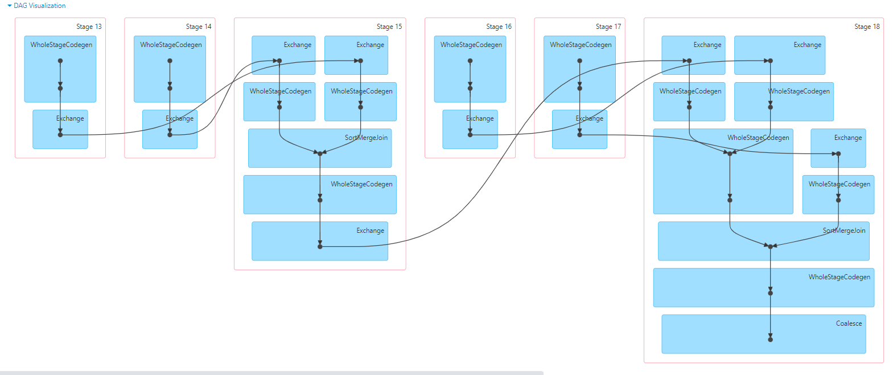
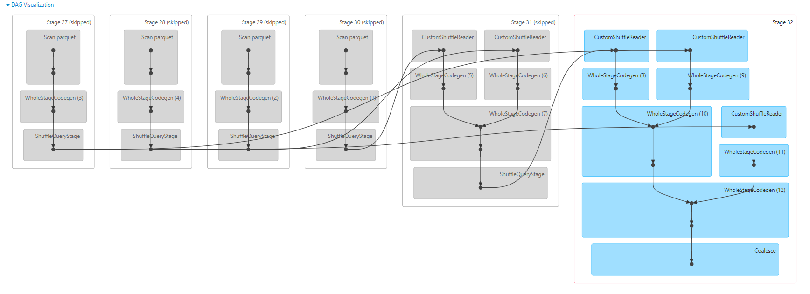

# Glue Auto Scaling

1. [동작방식](#동작방식)
2. [과금체계](#과금체계)
3. [별첨_비교자료](#별첨_비교자료)

## 동작방식

Glue Auto Scaling 은 Spark의 **dynamicAllocation 활성화**되는 것입니다.
Glue의 Worker가 지정한 Max Capacity 이상으로 Worker가 할당 되지는 않습니다. (Scale-Out)
단 Min Executor의 기본값이 1로 설정되므로 수행중인 task에 따라 최적화 작업은 진행됩니다. (Scale-In)
Auto Scaling을 활성화하게 되면 Glue Job 설정시 입력한 Worker 수에 따라 Max Executor가 지정됩니다.

- Auto Scaling 비활성화 : 

  > Worker Type이 G.1X인 경우 dirver와 executor의 메모리가 각각 10g로 설정되고
  > maxExecutors = Worker - 1(1은 Driver Node)
  >
  > 아래의 표는 Worker 를 10으로 설정했기 때문에 maxExecutors = 9 입니다.

- Auto Scaling 활성화 : 

  > Worker Type이 G.1X인 경우 dirver와 executor의 메모리가 각각 10g로 설정되고
  > minExecutors = 1 , maxExecutors = Worker - 1(1은 Driver Node)
  >
  > 아래의 표는 Worker 를 10으로 설정했기 때문에 maxExecutors = 9, minExecutors = 1 입니다.

| ENV Name                             | glue 2.0 | glue 3.0 | glue 3.0  autoscale |
| ------------------------------------ | -------- | -------- | ------------------- |
| spark.dynamicAllocation.enabled      | FALSE    | FALSE    | TRUE                |
| spark.driver.memory                  | 10g      | 10g      | 10g                 |
| spark.dynamicAllocation.maxExecutors | 9        | 9        | 9                   |
| spark.executor.instances             | 9        | 9        |                     |
| spark.dynamicAllocation.minExecutors | 1        |          | 1                   |
| spark.executor.memory                | 10g      | 10g      | 10g                 |

> 위의 표는 같은 Glue Job을 v2.0, v3.0, v3.0_autoscaling으로 수행했을 때의 주목할만한 Spark ENV들 입니다.
>
> Auto Scaling이 지정이 되면 dynamicAllocation이 활성화 됩니다.
> Driver와 Executor에 할당되는 메모리가 10g로 증가하고 그에 따라 Max Executor값은 감소합니다.

## 과금체계

같은 조건의 Glue Job을 Auto Scaling Option을 활성화 했을 때와 안했을 때를 비교한 표 입니다.
해당 표는 Glue Studio의 Monitoring Tab에서 확인 가능합니다.

| Job name             | Type      | Run time       | Capacity | Worker type | DPU hours | AutoScale | 감소량 |
| -------------------- | --------- | -------------- | -------- | ----------- | --------- | --------- | ------ |
| glue_v_3_dpu_60_auto | Glue ETL  | **3 minutes**  | 60       | G.1X        | 1.35      | O         | 0.63   |
| glue_v_3_dpu_30_auto | Glue  ETL | 2  minutes     | 30       | G.1X        | 0.7       | O         | 0.28   |
| glue_v_3_dpu_20_auto | Glue  ETL | 2  minutes     | 20       | G.1X        | 0.48      | O         | 0.2    |
| glue_v_3_dpu_10_auto | Glue  ETL | 3  minutes     | 10       | G.1X        | 0.31      | O         | 0.09   |
| glue_v_3_dpu_2_auto  | Glue  ETL | 8  minutes     | 2        | G.1X        | 0.26      | O         | 0.01   |
|                      |           |                |          |             |           |           |        |
| glue_v_3_dpu_60      | Glue  ETL | **2  minutes** | 60       | G.1X        | 1.98      | X         |        |
| glue_v_3_dpu_30      | Glue  ETL | 2  minutes     | 30       | G.1X        | 0.98      | X         |        |
| glue_v_3_dpu_20      | Glue  ETL | 2  minutes     | 20       | G.1X        | 0.68      | X         |        |
| glue_v_3_dpu_10      | Glue  ETL | 2  minutes     | 10       | G.1X        | 0.4       | X         |        |
| glue_v_3_dpu_2       | Glue  ETL | 8  minutes     | 2        | G.1X        | 0.27      | X         |        |

> G.1X의 경우 최소 과금 측정 단위는 (분) 입니다.
>
> Auto Scaling Option이 활성화 되면 유휴 DPU에 대해서는 과금 측정이 되지 않아 같은 작업이어도 DPU 사용량이 감소했음을 알 수 있습니다.

결론 : AutoScaling은 **Min-Max Executor 사이**에서 Scale In-Out 이 작동 되기 때문에 **비용 측면에서 절감 Point**가 있을 수 있지만 내부적으로 Max Executor 값으로 provisioning 되지 않기 때문에 **Scale Out 되면서 시간이 더 증가할 수** 있습니다.

## 별첨_비교자료

같은 Script를 수행했을 때 성능 차이와 이유입니다.

수행한 Script의 시나리오는 아래와 같습니다.

1. 4개의 Data를 S3에서 순차적으로 DataFrame으로 생성
2. 4개의 DataFrame을 View Table로 등록
3. Spark SQL에서 먼저 3개의 Table Left Join하여 Join_Table 생성
4. Join_Table 과 마지막 Table Left Join
5. 결과 Table을 DataFrame으로 생성 후 S3 Write

Data :

| Data            | Type    | Size      |
| --------------- | ------- | --------- |
| reviews         | parquet | 8.4  MiB  |
| reviews_detail  | parquet | 23.5 GiB  |
| products        | parquet | 960.9 MiB |
| products_detail | parquet | 480.1 MiB |

Check_List :

| Option         | glue 2.0                                                     | glue 3.0                                                     |
| -------------- | ------------------------------------------------------------ | ------------------------------------------------------------ |
| Execution time | 5 mins                                                       | 2 mins                                                       |
| Data Scan Time | Scan  parquet           number of output rows: 30,104,626 number of files: 1,992 metadata time (ms): 43 scan time total (min, med, max) 1.46 h (16.0 s, 32.6 s, 49.7 s ) | Scan  parquet number of output rows: 30,104,626 number of files read: 1,992 metadata time: 303 ms scan time total (min, med, max ) 9.1 m (1.8 s, 3.5 s, 4.8 s ) |
| Committer      | None                                                         | EmrOptimizedSparkSql ParquetOutputCommitter                  |
| AQE 지원       | X                                                            | O                                                            |

> 주목할만한 점은 크게 2가지 입니다. 
>
> - AQE 지원 : 자체적으로 최적화된 Plan을 제공합니다. 뒤에 DAG Image를 보면 알 수 있듯 위의 시나리오는 중간 Join없이 한번에 진행될 수 있는 Script인데 v2.0은 그대로 수행되고 v3.0은 plan을 최적화한 후 수행됩니다.
> - Commiter : v3.0부터 parquet에 대한 optimizer commiter를 지원하게 됩니다.
>   위의 표에서도 알 수 있는 가장 큰 23.5GB 데이터를 Scan하는데 소요되는 시간 차이가 큽니다.

DAG :

- v2.0
  
- v3.0
  