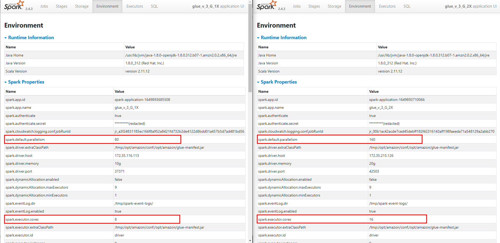
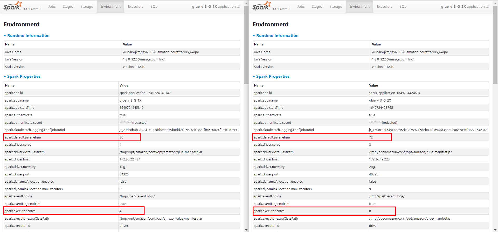

Worker 수 1을 기준으로 Worker Type별 수치

- Standard

  |          | v 2.0 | v 3.0 |
  | -------- | ----- | ----- |
  | DPU      | 1     | 1     |
  | Executor | 2     | 2     |
  | vCPU     | 4     | 4     |
  | Core     | 4     | 4     |
  | Task     | 4     | 4     |

- G.1X

  |          | v 2.0 | v 3.0 |
  | -------- | ----- | ----- |
  | DPU      | 1     | 1     |
  | Executor | 1     | 1     |
  | vCPU     | 4     | 4     |
  | Core     | 8     | 4     |
  | Task     | 8     | 4     |

- G.2X

  |          | v 2.0 | v 3.0 |
  | -------- | ----- | ----- |
  | DPU      | 2     | 2     |
  | Executor | 1     | 1     |
  | vCPU     | 8     | 8     |
  | Core     | 16    | 8     |
  | Task     | 16    | 8     |

Glue Spark UI

- v 2.0 (App name 과 달리 2.0이 맞습니다.)

  

  > spark.default.parallelism = Core 수  *  **Worker 수**

- v 3.0

  

  > spark.default.parallelism = Core 수  *  **Executor 수**

확인 사항

- Spark 에서 실제 작업 수행에 필요한 양보다 병렬성이 적거나 많을 때 오히려 성능이 낮아지는 현상이 있는데 Glue 3.0을 기준으로 병렬성을 감소하여 성능 향상을 목표로 함
- 따라서  Glue 3.0은 G.1X / G.2x는 Executor 당 4 / 8 Core로 병렬성을 감소
- Glue 2.0 기준 **1vCPU 당 2 Core** 가 할당 되던 내용이 Glue 3.0에서 **1 vCPU당 1 Core**로 변경
- [AWS Blog](https://aws.amazon.com/ko/blogs/big-data/best-practices-to-scale-apache-spark-jobs-and-partition-data-with-aws-glue/)는 Glue 2.0 이전 기준으로 작성된 글

결론

Glue 3.0 부터는 G.1X와 G.2X는 **Task당 처리량을 높이고 병렬성을 감소시켜 성능을 향상** 시켰다고 판단 됩니다. 

참고 URL

- [Worker Type](https://docs.aws.amazon.com/glue/latest/dg/add-job.html)
- [Glue AWS Blog](https://aws.amazon.com/ko/blogs/big-data/best-practices-to-scale-apache-spark-jobs-and-partition-data-with-aws-glue/)
- [Glue 3.0 변경사항](https://docs.aws.amazon.com/glue/latest/dg/migrating-version-30.html#migrating-version-30-from-20)
- [SR 진행 내역](https://us-east-1.console.aws.amazon.com/support/home?region=us-east-1#/case/?displayId=9905399981&language=en)