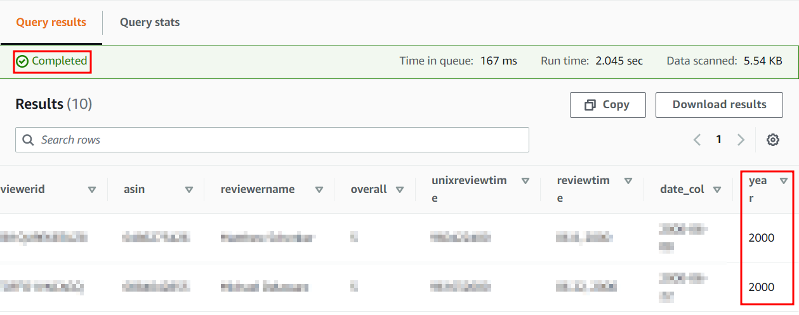
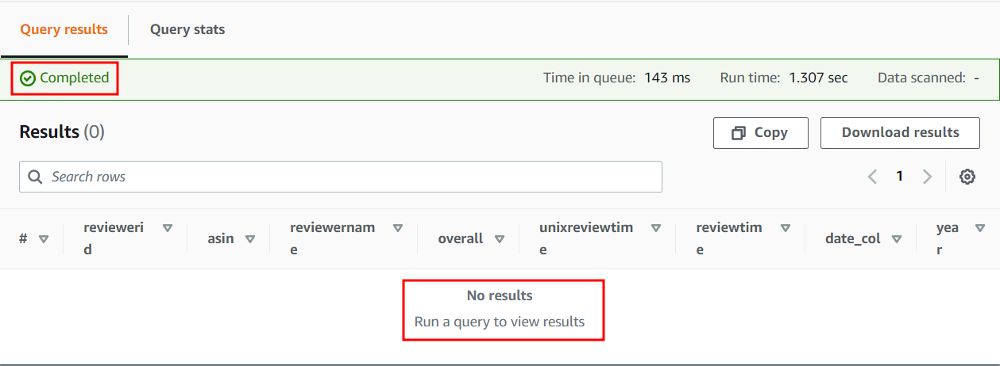
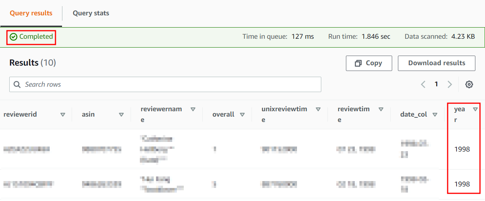
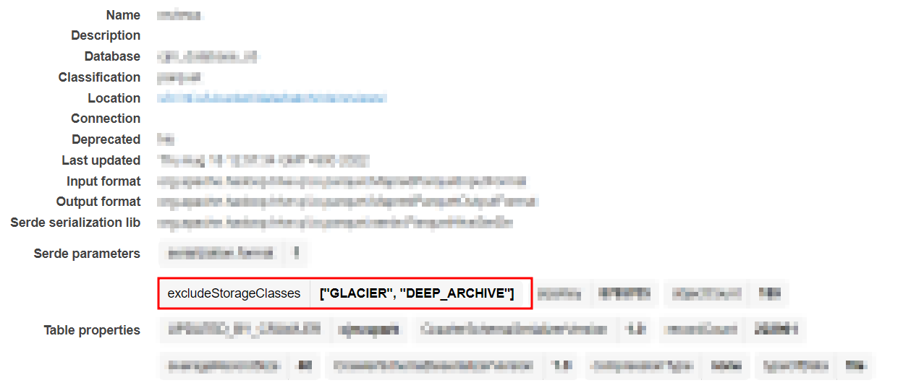
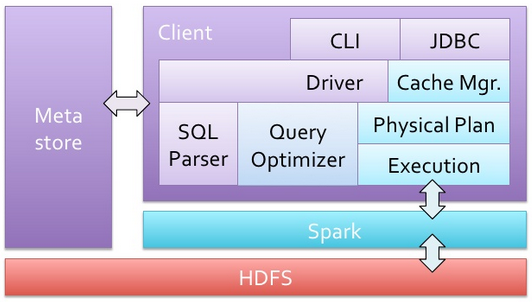

S3에는 다양한 스토리지 클래스가 있습니다. Standard, Glacier, Deep Archive ...etc

S3에 존재하는 정형 데이터에 대해 Glue Catalog를 생성하고 Athena, Glue Job, EMR 등에서 쉽게 접근 및 사용이 가능합니다.

다양한 서비스에서 Glue Catalog에 접근하여 Data를 조회하는 방식이 API 기반으로 이루어지기 때문에 Standard Storage Class에 대해서만 지원하는 경우가 많습니다.

하지만 S3의 관리 차원에서 Life Cycle Management 를 이용하여 일정 기간 이상의 Object들에 대해서는 Storage Class를 변경하거나 삭제하기도 합니다.

S3에 원본 데이터가 존재하고 이를 기반으로 Glue Table을 생성했을 때 원본 데이터의 일부가 Storage Class가 Standard가 아닌 다른 Class로 설정이 되어 있다면 Glue Catalog를 사용하는 타 Service에서는 어떻게 조회 될까요?

예시 상황)

S3 Data Structure (year 기준 partitioning, 1997년 Data는 Glacier에 존재)

```bash
sample-bucket-name/
├── data/batch/rds/sample-table-name/
    ├── year=1997/			<= Glacier Storage Class
    │   ├── part-00000-7eadd606-a466-4aaa-894a-49263bbaa788.c000.snappy.parquet
    │   ├── part-00001-7eadd606-a466-4aaa-894a-49263bbaa788.c000.snappy.parquet
    │   ├── part-00002-7eadd606-a466-4aaa-894a-49263bbaa788.c000.snappy.parquet
    │   ├── part-00003-7eadd606-a466-4aaa-894a-49263bbaa788.c000.snappy.parquet
    │   ├── part-00004-7eadd606-a466-4aaa-894a-49263bbaa788.c000.snappy.parquet
    │   ├── part-00005-7eadd606-a466-4aaa-894a-49263bbaa788.c000.snappy.parquet
    │   ├── part-00007-7eadd606-a466-4aaa-894a-49263bbaa788.c000.snappy.parquet
    │   ├── part-00008-7eadd606-a466-4aaa-894a-49263bbaa788.c000.snappy.parquet
    ├── year=1998
    │   ├── part-00000-7eadd606-a466-4aaa-894a-49263bbaa788.c000.snappy.parquet
    │   ├── part-00001-7eadd606-a466-4aaa-894a-49263bbaa788.c000.snappy.parquet
    │   ├── part-00002-7eadd606-a466-4aaa-894a-49263bbaa788.c000.snappy.parquet
    │   ├── part-00003-7eadd606-a466-4aaa-894a-49263bbaa788.c000.snappy.parquet
    │   ├── part-00004-7eadd606-a466-4aaa-894a-49263bbaa788.c000.snappy.parquet
    │   ├── part-00005-7eadd606-a466-4aaa-894a-49263bbaa788.c000.snappy.parquet
    │   ├── part-00006-7eadd606-a466-4aaa-894a-49263bbaa788.c000.snappy.parquet
    │   ├── part-00007-7eadd606-a466-4aaa-894a-49263bbaa788.c000.snappy.parquet
    │   ├── part-00008-7eadd606-a466-4aaa-894a-49263bbaa788.c000.snappy.parquet
    ├── year=1999/
    │   ├── part-00000-7eadd606-a466-4aaa-894a-49263bbaa788.c000.snappy.parquet

...
```

Glue Database : sample-db-name

Glue Table : sample-table-name

1. Athena : Athena는 2021년 7월 30일부터 S3 Glacier Deep Archive 파일을 건너뛰고 실행합니다. (Skip & Ignore)

   > [Athena Release Note](https://docs.aws.amazon.com/athena/latest/ug/release-notes.html#release-notes-2021)

   - Standard + Glacier Data 조회시 :

     ```sql
     SELECT * FROM "sample-db-name"."sample-table-name" limit 10;
     ```

     

   - Glacier Data 조회 시 : 

     ```sql
     SELECT * FROM "sample-db-name"."sample-table-name" where year='1997' limit 10;
     ```

     

   - Standard Data 조회시 :

     ```sql
     SELECT * FROM "sample-db-name"."sample-table-name" where year='1998' limit 10;
     ```

     

     

2. Glue Job : Glue Job 자체적으로 제공되는 dynamicframe에서는 "excludeStorageClasses" 라는 option을 통해 Standard 외의 Class들을 예외 처리 할 수 있습니다.

   > [동적 프레임 생성 시 Amazon S3 스토리지 클래스 제외](https://docs.aws.amazon.com/glue/latest/dg/aws-glue-programming-etl-storage-classes.html#aws-glue-programming-etl-storage-classes-dynamic-frame)

   ```python
   glueContext.create_dynamic_frame.from_catalog(
       database = "sample-db-name",
       tableName = "sample-table-name",
       additional_options = {
           "excludeStorageClasses" : ["GLACIER", "DEEP_ARCHIVE"]
       }
   )
   ```

   

   

3. Spark : "spark.sql.files.ignoreCorruptFiles" 옵션을 true로 활성화할 경우 spark-sql에 한에서 Glacier Data를 무시하고 Data 조회가 가능합니다.

   적용 방법 : 

   ```python
   spark.sql("set spark.sql.files.ignoreCorruptFiles=true")
   ```

   > ignoreCorruptFiles 옵션은 FileNotFoundException 에 대한 예외 처리 입니다.
   >
   > ```scala
   > catch {
   >  case e: FileNotFoundException if ignoreMissingFiles => 
   >  logWarning(
   >      s "Skipped missing file: $currentFile", e) 
   >  finished = true 
   >  null
   >  // Throw FileNotFoundException even if `ignoreCorruptFiles` is true
   >  case e: FileNotFoundException if !ignoreMissingFiles => throw e
   >  case e @ (_: RuntimeException | _: IOException) if ignoreCorruptFiles => 
   >  logWarning( s"Skipped the rest of the content in the corrupted file: $currentFile", e) 
   >  finished = true 
   >  null
   > } 
   > ```
   >
   > [ignoreCorruptFiles 참고](https://blog.actorsfit.com/a?ID=01400-f58d03b7-5d5c-4d20-9119-2dc8fcd2e70d)
   >
   > Spark Architecture
   >
   > 
   >
   > [출처 : http://www.slideshare.net/Hadoop_Summit/spark-and-shark]
   >
   > Spark-SQL의 경우 AWS의 EMR에서 수행 시 HIVE나 Glue의 Meta Table들을 활용하여 물리 Data를 Scan 합니다.
   >
   > Table에 저장 된 경로를 통해 물리 Data에 접근 시 FileNotFoundException 발생하여 Glacier Data들을 무시하는 것으로 보입니다.
   >
   > Spark Dataframe의 경우 직접 물리 Data를 Scan 합니다.
   >
   > S3 물리 Data에 접근하며 AmazonS3Exception 발생하고 실패합니다.

   1. Spark-SQL : 

      ```python
      # Standard + Glacier Data 조회시 :
      query1 = """SELECT * FROM `sample-db-name`.`sample-table-name`"""
      spark.sql(query1).show()
      
      +--------------+----------+--------------------+-------+--------------+-----------+----------+----+
      |    reviewerid|      asin|        reviewername|overall|unixreviewtime| reviewtime|  date_col|year|
      +--------------+----------+--------------------+-------+--------------+-----------+----------+----+
      |XXXXXXXXXXXXXX|xxxxxxxxxx|             XXXXXXX|      4|    0000000000| 02 1, 2013|2013-02-01|2013|
      |yyyyyyyyyyyyyy|yyyyyyyyyy|             yyyyyyy|      4|    0000000000|03 30, 2013|2013-03-30|2013|
      |zzzzzzzzzzzzzz|zzzzzzzzzz|             zzzzzzz|      4|    0000000000|05 12, 2013|2013-05-12|2013|
      |																						  |
      |     ...      |   ...    |        ...         |    ...|      ...     |    ...    |   ...    |2013|
      +--------------+----------+--------------------+-------+--------------+-----------+----------+----+
      
      
      # Glacier Data 조회시 :
      query2 = """SELECT * FROM `sample-db-name`.`sample-table-name` where year='1997'"""
      spark.sql(query2).show()
      
      
      +----------+----+------------+-------+--------------+----------+--------+----+
      |reviewerid|asin|reviewername|overall|unixreviewtime|reviewtime|date_col|year|
      +----------+----+------------+-------+--------------+----------+--------+----+
      +----------+----+------------+-------+--------------+----------+--------+----+
      
      # Standard Data 조회시 :
      query3 = """SELECT * FROM `sample-db-name`.`sample-table-name` where year='1998'"""
      spark.sql(query3).show()
      
      +--------------+----------+--------------------+-------+--------------+-----------+----------+----+
      |    reviewerid|      asin|        reviewername|overall|unixreviewtime| reviewtime|  date_col|year|
      +--------------+----------+--------------------+-------+--------------+-----------+----------+----+
      |XXXXXXXXXXXXXX|xxxxxxxxxx|             XXXXXXX|      4|    0000000000| 02 1, 1998|1998-02-01|1998|
      |yyyyyyyyyyyyyy|yyyyyyyyyy|             yyyyyyy|      4|    0000000000|03 30, 1998|1998-03-30|1998|
      |zzzzzzzzzzzzzz|zzzzzzzzzz|             zzzzzzz|      4|    0000000000|05 12, 1998|1998-05-12|1998|
      |																						  |
      |     ...      |   ...    |        ...         |    ...|      ...     |    ...    |   ...    |1998|
      +--------------+----------+--------------------+-------+--------------+-----------+----------+----+
      ```

      

   2. Spark Dataframe

      ```python
      # Standard + Glacier Data 조회시 :
      # Glacier Data 조회시 :
      spark.read.option("header",True).parquet("s3://sample-bucket-name/data/batch/rds/sample-table-name/year=1997/").show()
      spark.read.option("header",True).parquet("s3://sample-bucket-name/data/batch/rds/sample-table-name/").show()
      
      ================ ERROR ================
      WARN TaskSetManager: Lost task 0.0 in stage 5.0 (TID 5) (ip-xx-x-xxx-xx.ap-northeast-2.compute.internal executor 1): org.apache.spark.SparkException: Exception thrown in awaitResult:
              at org.apache.spark.util.ThreadUtils$.awaitResult(ThreadUtils.scala:301)
              at org.apache.spark.util.ThreadUtils$.parmap(ThreadUtils.scala:375)
              at org.apache.spark.sql.execution.datasources.parquet.ParquetFileFormat$.readParquetFootersInParallel(ParquetFileFormat.scala:743)
      ...
      Caused by: java.io.IOException: Unexpected end of stream pos=0, contentLength=2104
              at com.amazon.ws.emr.hadoop.fs.s3.S3FSInputStream.read(S3FSInputStream.java:297)
              at java.io.BufferedInputStream.fill(BufferedInputStream.java:246)
              at java.io.BufferedInputStream.read(BufferedInputStream.java:265)
      ...
      Caused by: java.io.IOException: com.amazon.ws.emr.hadoop.fs.shaded.com.amazonaws.services.s3.model.AmazonS3Exception: The operation is not valid for the object's storage class (Service: Amazon S3; Status Code: 403; Error Code: InvalidObjectState; Request ID: 2H5QW79SR7M40GC7; S3 Extended Request ID: FVpoWPsy5J6gAGVUNlc/SfpFfBC6Awn0Etnada0nOKU5uMXE1R4Hg25DaJATrDgg3kl7MbBOAc8=; Proxy: null), S3 Extended Request ID: FVpoWPsy5J6gAGVUNlc/SfpFfBC6Awn0Etnada0nOKU5uMXE1R4Hg25DaJATrDgg3kl7MbBOAc8=
              at com.amazon.ws.emr.hadoop.fs.s3.S3FSInputStream.open(S3FSInputStream.java:226)
              at com.amazon.ws.emr.hadoop.fs.s3.S3FSInputStream.retrieveInputStreamWithInfo(S3FSInputStream.java:391)
              at com.amazon.ws.emr.hadoop.fs.s3.S3FSInputStream.reopenStream(S3FSInputStream.java:378)
              at com.amazon.ws.emr.hadoop.fs.s3.S3FSInputStream.read(S3FSInputStream.java:260)
              ... 24 more
      ================================================
              
      # Standard Data 조회시 :
      spark.read.option("header",True).parquet("s3://sample-bucket-name/data/batch/rds/sample-table-name/year=1999/").show()
      
      +--------------+----------+--------------------+-------+--------------+-----------+----------+----+
      |    reviewerid|      asin|        reviewername|overall|unixreviewtime| reviewtime|  date_col|year|
      +--------------+----------+--------------------+-------+--------------+-----------+----------+----+
      |XXXXXXXXXXXXXX|xxxxxxxxxx|             XXXXXXX|      4|    0000000000| 02 1, 1998|1998-02-01|1998|
      |yyyyyyyyyyyyyy|yyyyyyyyyy|             yyyyyyy|      4|    0000000000|03 30, 1998|1998-03-30|1998|
      |zzzzzzzzzzzzzz|zzzzzzzzzz|             zzzzzzz|      4|    0000000000|05 12, 1998|1998-05-12|1998|
      |																						  |
      |     ...      |   ...    |        ...         |    ...|      ...     |    ...    |   ...    |1998|
      +--------------+----------+--------------------+-------+--------------+-----------+----------+----+
      ```

      
