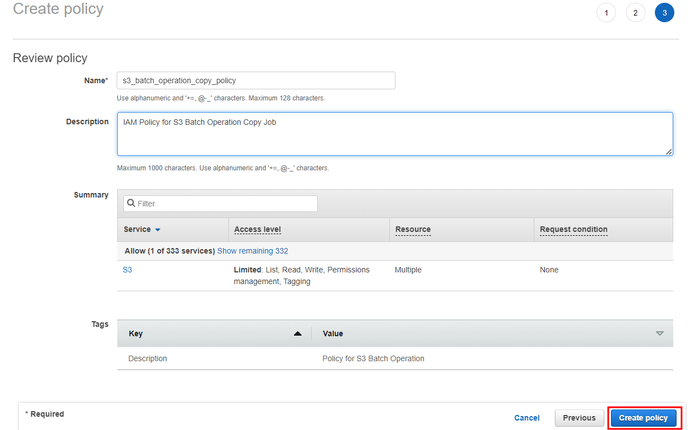
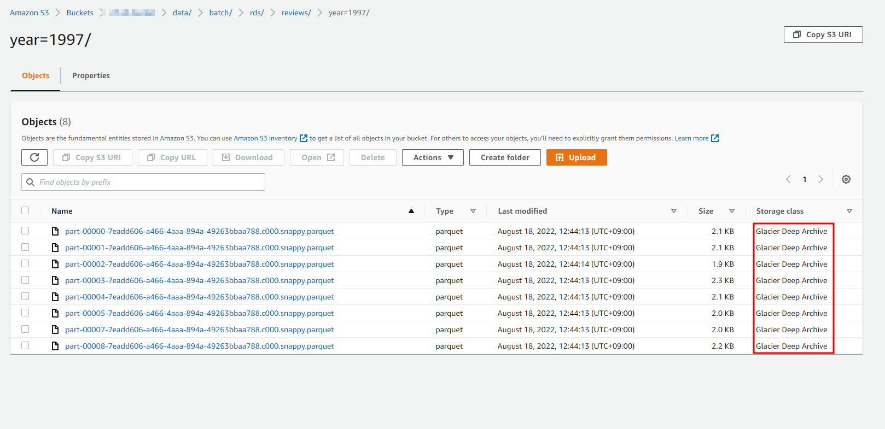
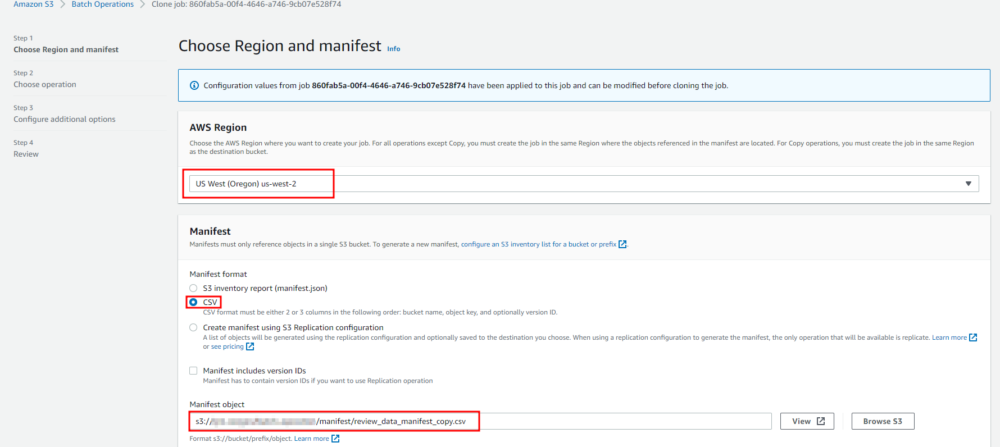

Standard Storage Class가 아닌 Object 를 API 기반의 조회나 작업을 하기 위해서는 복원이라는 절차가 수행되어야 합니다.

복원은 콘솔에서 직접 복원 처리와 batch operation이라는 기능을 이용한 자동 처리로 가능합니다.

## 1. Console Restore

Console에서의 복원 작업은 2가지 장점이 있습니다.

1. UI를 몇번 선택함으로써 빠르게 작업 수행이 가능합니다.
2. "Expedited retrieval" 이라는 빠른 복원 방법을 제공합니다.

2가지 단점 또한 존재합니다.

1. Console에서 Check box 선택에 제약이 있기 때문에 많은 object 복원이 어렵습니다.
2. 빠른 복원인 "Expedited retrieval" 이라는 방법은 객체 용량이 250MB로 제한적입니다.

복원을 원하는 객체의 체크 박스를 선택 후 "Initiate restore"를 선택합니다.


Console에서의 복원은 "Expedited retrieval" 방법을 지원합니다.

약 5분 안에 복원이 가능하므로 시간 단위의 소요 시간이 발생하는 다른 방법들보다 빠릅니다. (단, Glacier Flexible Retrieval (formerly Glacier) 이상의 class만 가능합니다.)


## 2. S3 Batch Operation

S3 Batch Operation은 Amazon S3 Object에 대해 대규모 배치 작업을 수행할 수 있는 기능입니다. 

S3 Batch Operation은 지정한 Amazon S3 객체 목록에 대해 단일 작업을 수행할 수 있습니다. 
단일 작업은 엑사바이트의 데이터를 포함하는 수십억 개의 개체에 대해 지정된 작업을 수행할 수 있습니다. Amazon S3는 진행 상황을 추적하고, 알림을 보내고, 모든 작업에 대한 자세한 완료 보고서를 저장하여 감사 가능한 완전 관리형 서버리스 환경을 제공합니다. 

크게 4가지 기능이 가능합니다.

- 객체 복원
- 객체 복사
- 객체 태깅
- 액세스 제어 목록(ACL)을 설정

S3 Glacier Flexible Retrieval에서 객체 복원을 시작하거나 AWS Lambda 함수를 호출하여 객체를 사용하여 사용자 지정 작업을 수행할 수 있습니다. 사용자 지정 객체 목록에서 이러한 작업을 수행하거나 Amazon S3 인벤토리 보고서를 사용하여 객체 목록을 쉽게 생성할 수 있습니다.

S3 Batch Operation에서의 복원 작업은 2가지 장점이 있습니다.

1. 작업에 대한 설정이 완료되면 자동으로 복원 작업이 처리됩니다.
2. 객체 수나 용량에 대하 제한이 없이 복원이 가능합니다.

1가지 단점 또한 존재합니다.

1. 빠른 복원인 "Expedited retrieval" 이라는 방법을 제공하지 않습니다. 따라서 최소 3시간 이상의 복원 작업 시간이 필요합니다.

S3 Batch Operation 수행 방법은 IAM 생성과 Job 생성으로 나눌 수 있습니다.

복원 작업을 수행하기 위해 IAM을 통한 권한 부여와 작업에 대한 명세를 제공하는 Job을 생성해야 합니다.

1. IAM 생성

   IAM Role을 생성 합니다.

   해당 Role을 Job 수행을 위해 부여되는 권한으로 신뢰관계로 "S3 Batch Operations"를 선택합니다.

   

   Custom 하게 권한을 부여하기 위해 "Create Policy" 를 선택합니다.

   

   신규 Policy에 대한 권한을 설정합니다.

   

   - Restore Policy

     - SOURCE_BUCKET : 복원 대상이 되는 Object를 저장한 Bucket
     - MANIFEST_BUCKET : Batch Operation Job을 위한 Target 명세를 작성한 파일이 저장된 Bucket
     - REPORT_BUCKET : Batch Operation Job의 결과를 저장할 Bucket

     ```json
     {
       "Version":"2012-10-17",
       "Statement":[
         {
           "Effect":"Allow",
           "Action":[
               "s3:RestoreObject"
           ],
           "Resource": [
             "arn:aws:s3:::{SOURCE_BUCKET}/{PATH}/*"
           ]
         },
         {
           "Effect": "Allow",
           "Action": [
             "s3:GetObject",
             "s3:GetObjectVersion"
           ],
           "Resource": [
             "arn:aws:s3:::{MANIFEST_BUCKET}/{MANIFEST_PATH}/*"
           ]
         },
         {
           "Effect":"Allow",
           "Action":[
             "s3:PutObject"
           ],
           "Resource":[
             "arn:aws:s3:::{REPORT_BUCKET}/{REPORT_PATH}/*"
           ]
         }
       ]
     }
     ```

   - Copy Policy

     - Target_BUCKET : 복사 후 저장할 Bucket
     - SOURCE_BUCKET : 복사 대상이 되는 Object를 저장한 Bucket
     - MANIFEST_BUCKET : Batch Operation Job을 위한 Target 명세를 작성한 파일이 저장된 Bucket
     - REPORT_BUCKET : Batch Operation Job의 결과를 저장할 Bucket

     ```json
     {
         "Version": "2012-10-17",
         "Statement": [
             {
                 "Action": [
                     "s3:PutObject",
                     "s3:PutObjectAcl",
                     "s3:PutObjectTagging"
                 ],
                 "Effect": "Allow",
                 "Resource": [
                   "arn:aws:s3:::{Target_BUCKET}/{PATH}/*"
                 ]
             },
             {
                 "Action": [
                     "s3:GetObject",
                     "s3:GetObjectAcl",
                     "s3:GetObjectTagging",
                     "s3:ListBucket"
                 ],
                 "Effect": "Allow",
                 "Resource": [
                     "arn:aws:s3:::{SOURCE_BUCKET}",
                     "arn:aws:s3:::{SOURCE_BUCKET}/{PATH}//*"
                 ]
             },
             {
                 "Effect": "Allow",
                 "Action": [
                     "s3:GetObject",
                     "s3:GetObjectVersion"
                 ],
                 "Resource": [
                   "arn:aws:s3:::{MANIFEST_BUCKET}/{MANIFEST_PATH}/*"
                 ]
             },
             {
                 "Effect": "Allow",
                 "Action": [
                     "s3:PutObject"
                 ],
                 "Resource": [
                   "arn:aws:s3:::{REPORT_BUCKET}/{REPORT_PATH}/*"
                 ]
             }
         ]
     }
     ```

   

   검토 후 생성합니다.

   

   Policy 생성이 완료됐다면 Role Tab으로 이동합니다.

   오른쪽 상단의 Refresh를 진행 후 방금 전 생성한 Policy를 Attach 합니다.

   

   검토 후 Role 생성을 완료 합니다.

   

2. Manifest File 생성
   Manifest File은 작업 대상에 대한 세부내용을 작성한 파일이며 csv, json 으로 작성 가능합니다.

   [참고](https://docs.aws.amazon.com/AmazonS3/latest/userguide/batch-ops-create-job.html#specify-batchjob-manifest)

   Manifest File에 작성할 Object에 대해 CLI로 List-up 합니다.

   ```sh
   aws s3 ls s3://{SOURCE_BUCKET}/{PATH}/ --recursive
   ```

   

   아래와 같이 CSV 파일로 작성 후 `s3://{MANIFEST_BUCKET}/{MANIFEST_PATH}/` 위치에 upload 합니다.

   

3. 복원 Job

   S3 왼쪽 사이드 바에서 "Batch Operations" 를 선택 후 "Create Job" 을 선택합니다.

   

   Manifest 파일 타입과 S3 key를 입력합니다.

   

   "Restore"를 선택합니다.

   

   복원 후 Retention 기간을 지정하여 기간 종료 후에는 원래의 Storage Class로 원복 됩니다.

   

   여러 개의 Batch Job이 수행될 경우 Priority를 높게 잡아야 하지만 단일 수행이므로 default 값인 10을 입력합니다.

   Report는 작업 내역에 대한 결과를 S3에 저장하는 파일 입니다.

   작성할 내용과 저장할 S3 key를 입력합니다.

   

   위에서 생성한 Role을 입력하여 권한을 부여 합니다.

   

   생성이 완료되면 Status : `Awaiting your confirmation to run` 이 됩니다.

   `Run job`으로 수행이 가능합니다.

   

   복원 전의 S3 Object들의 Storage Class 는 Glacier 입니다.

   

   복원이 진행되면 최소 3시간 이상 `In progress` 형태로 복원이 진행됩니다.

   

   Restoration status가 Completed가 되면 복원이 완료 되고 API 기반의 Object 사용이 가능합니다.

   

   단, 복원이 완료되도 Storage Class는 변동되지 않습니다.

   

   복원 전 Spark의 EMRFS를 활용한 데이터 조회
   

   `The operation is not valid for the object's storage class` 라는 오류를 확인할 수 있습니다.

   

   복원 후 조회 시 정상적으로 데이터를 출력할 수 있습니다.

   

4. 복사 Job

   복원은 임시로 사용이 필요한 경우 수행되는 작업 입니다. Retention 기간이 끝나면 원래의 Storage class 옵션에 따라 API 기반의 작업이 불가능합니다. 따라서 Object들을 Standard Storage Class로 변경하려면 복사 작업을 통해 변경합니다.

   S3 왼쪽 사이드 바에서 "Batch Operations" 를 선택 후 "Create Job" 을 선택합니다.

   

   Manifest 파일 타입과 S3 key를 입력합니다.

   

   Manifest 파일 타입과 S3 key를 입력합니다.

   

   "Copy"를 선택합니다.

   

   Destination에 Target_PATH를 입력합니다.

   Warning Message는 같은 파일이 Destination에 존재할 경우 Overwrite 한다는 내용입니다.

   copy 시 생기능 내용과 동일합니다.

   

   기타 옵션들은 Default 값으로 진행합니다.

   

   Report는 작업 내역에 대한 결과를 S3에 저장하는 파일 입니다.

   작성할 내용과 저장할 S3 key를 입력합니다.

   

   위에서 생성한 Role을 입력하여 권한을 부여 합니다.

   

   생성이 완료되면 Status : `Awaiting your confirmation to run` 이 됩니다.

   `Run job`으로 수행이 가능합니다.

   

   복원 전의 S3 Object들의 Storage Class 는 Glacier 입니다.

   

   복원 후에는 Standard 임을 확인할 수 있습니다.

   단, 복사 수행 시 유의할 점은 복사를 진행하므로써 해당 파일들을 신규 파일로 인식이 되기 때문에 Life Cycle Management가 적용되어 있을 경우 0일 부터 시작된다는 것입니다.

   
